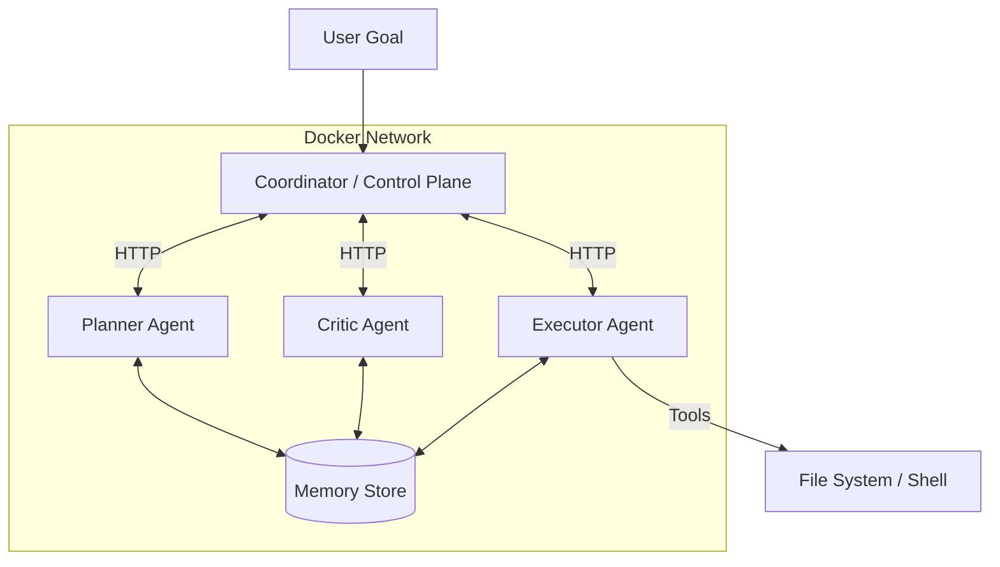

# Autonomous Multi-Agent System Architecture

## Overview
This system implements a self-learning, autonomous agent architecture composed of three specialized agents (Planner, Executor, Critic) running in isolated containers, coordinated by a central control plane.

## Architecture

### 1. Agents
- **Planner (Agent A)**: BREAKS DOWN high-level goals into executable sub-goals. Uses semantic memory to recall successful strategies.
- **Executor (Agent B)**: EXECUTES sub-goals using tools (Shell, File I/O, Web). It is the only agent with side-effect capabilities.
- **Critic (Agent C)**: REVIEWS plans and execution results. Enforces safety and quality standards before actions are finalized.

### 2. Communication
- Agents communicate via HTTP (FastAPI) using a strict JSON schema (`AgentMessage`).
- The **Coordinator** acts as the message bus and state manager.

### 3. Memory & Learning
- **ChromaDB** is used for long-term vector memory.
- **Self-Learning Loop**: Success/Failure patterns are stored as "lessons" in memory. Future plans query this memory to avoid repeating mistakes.

### 4. Infrastructure
- **Fully Docked**: Each agent runs in its own container (`python:3.14-slim` base).
- **Isolation**: The Executor acts within a specific workspace volume, isolated from the host system except for defined bind mounts.

## System Diagram



## Setup & Execution

### Prerequisites
1. Docker & Docker Compose installed.
2. A GGUF LLM model (e.g., Qwen2.5-7B) placed in `./models/model.gguf`.

### Running the System
1. Build and Start Services:
   ```bash
   docker-compose up --build -d
   ```

2. Run a Mission:
   ```bash
   docker-compose run coordinator
   ```
   *Modify the goal in `agent/core/coordinator.py` main block to change the mission.*

### Development
- **Agents Code**: `agent/agents.py`
- **Protocol**: `agent/core/protocol.py`
- **Coordinator**: `agent/core/coordinator.py`
